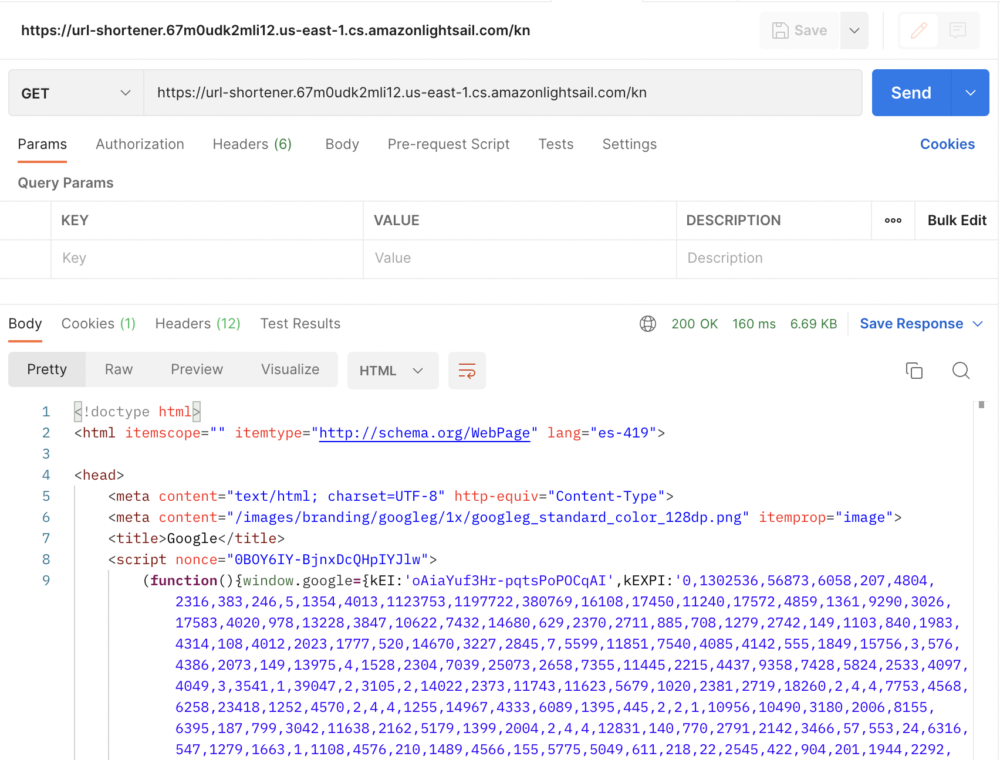

# URL Shortener Test (Solution)
The aplication is currently deployed on AWS Lightsail container service [here](https://url-shortener.67m0udk2mli12.us-east-1.cs.amazonlightsail.com/). Please read the documentation for usage.


## Development Best Practices
For the developmet of the project there are a couple best practices. To follow:

### Git, Commits and PRs
Along the progres and development of the project, git flow has been used as well as a PR template to keep consistency and clarity of the commits and code merges.
- [Commits](https://github.com/JRobertGit/url-shortener/commits/master)
- [Pull Requests](https://github.com/JRobertGit/url-shortener/pulls?q=is%3Apr+is%3Aclosed)


### Code Style and Pre-commit
- The project uses black code formater and flake8 to mantain code style consistency across all modules. For this we use modules `black` and `flake8`.
- Before any commit can be done, a `pre-commit` hook is run to ensure style and code format is repected. For this we use the `pre-commit` module.
## Requirements & Development Setup

- Python 3.9
```bash
brew install python
```
- SQLite
```bash
brew install sqlite
```

Using `python 3.9`
```bash
python3 -m venv venv
source venv/bin/activate
# inside venv
(venv) pip install -r requirements.txt
```

## Tests and DEV Start up
To run functional and unit tests, and get code coverage check run:
```bash
# inside venv
(venv) python -m pytest --cov=app
```


To run the project on localhost:
```bash
# inside venv
(venv) export FLASK_APP=app
(venv) export FLASK_ENV=development
(venv) flask run
```
This will start the application over [127.0.0.1:5000/](127.0.0.1:5000/)


# API Usage
URL Shortener API supports the following routes and operations:
```
# API Test Route
GET     localhost:5000/

# Will decode the shortened URL and redirect to the original URL
GET     localhost:5000/<shortcode>

# Will create and return a new shortcode a provided URL
POST    localhost:5000/api/shortener

# Will return the original URL string given the shortcode identifier
GET     localhost:5000/api/shortener/<shortcode>
```
- GET     `localhost:5000/`

- GET `localhost:5000/<shortcode>`

- POST    `localhost:5000/api/shortener`

- GET     `localhost:5000/api/shortener/<shortcode>`


# Run as Container
The docker file to create the image to run the app as a container is straight forward. It adds some automation to the set up, and takes care of the dependencies, requirements and environment.
```Dockerfile
FROM python:3.9.13-slim-buster
WORKDIR /url_shortener

ENV FLASK_APP=app
ENV FLASK_RUN_HOST=0.0.0.0

COPY requirements.txt ./
RUN pip install -r requirements.txt

COPY app ./app

EXPOSE 5000
CMD ["flask", "run"]
```
To run using `docker`:
```bash
# to generate the image
docker build .
# to run the generated image
docker run -d -p 5000:5000 --name url_shortener <image_sha>
```
# Design
The application was design taking into consideration the low complexity requirements. Many sugar coated and more complex libraries were not used (like `Flask-RESTful`) to keep the application simple.

The application is a simple `Flask API` with access to a small `SQLite` local database. So the project is structured according to that.
- `./app/util/url_shortener.py` holds the implementation of the actual URL shortener which is based on one of the siplest ways to address the problem, which is a mathematical change in base using the `id` integer of the URL record inserted. This allow us to represent a big space of URL, and hardly running out of `shortcodes` to encode big URLS.
- On `./app/controllers` we'll find API related controllers that define the aplication's enpoints that use templates.
- A data access layer was added under `./app/data_access` to abstract most of the complexity behind `SQLAlchemy` session.
- For models there's nothing much to mention. the `./app/database/models.py` holds the `db` object as well as the definition of the unique entity model `ShortenedURL`.
